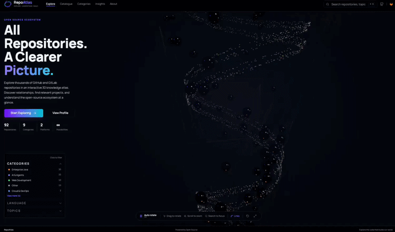
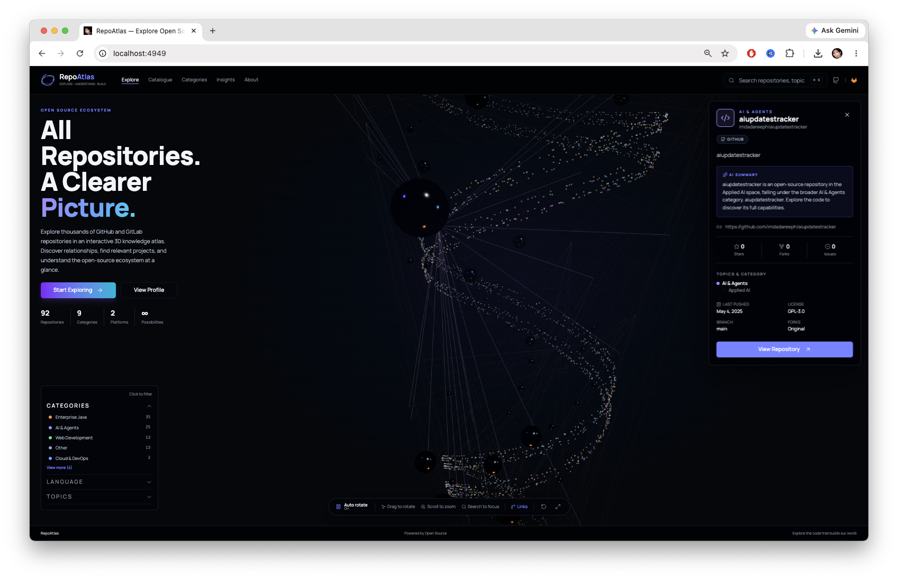
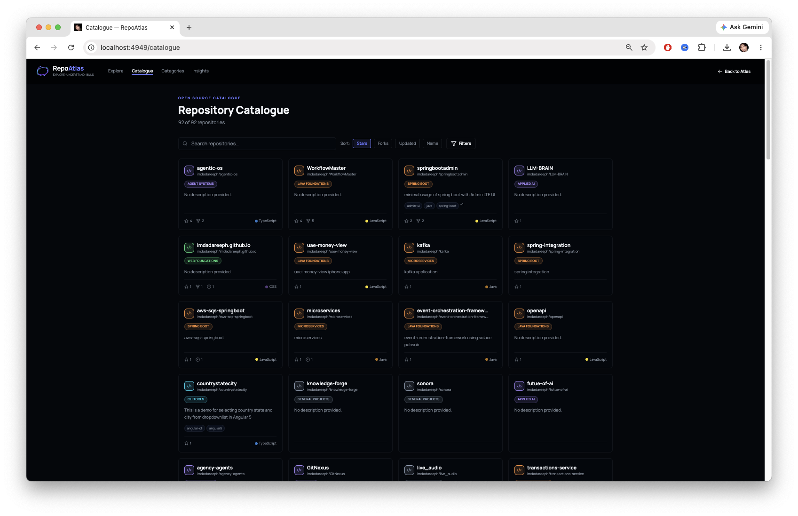

<a href="https://github.com/fib1618agent/repo-atlas">
  
</a>

<br/>
<br/>

<div align="center">

# RepoAtlas

> **An Interactive 3D Atlas of Open Source Repositories**

<strong>
Explore GitHub repositories as colored marbles in a rotating hurricane funnel.
<br />
Live GitHub sync · category taxonomy · search &amp; filters · optional Gemini summaries.
</strong>

<br />
<br />

<p align="center">
  <a href="https://react.dev/"></a>
  <a href="https://tanstack.com/start"></a>
  <a href="https://tanstack.com/query"></a>
  <a href="https://bun.sh/"></a>
  <a href="https://threejs.org/"></a>
  <a href="https://tailwindcss.com/"></a>
  <a href="https://workers.cloudflare.com/"></a>
  <a href="https://zustand.docs.pmnd.rs/"></a>
  <a href="https://ai.google.dev/"></a>
  <a href="https://www.linkedin.com/newsletters/agentic-coding-newsletters-7381811323283787776/"></a>
  <a href="https://youtu.be/3S6me3MxIAo"></a>
  <a href="https://discord.gg/sPQGKvGT"></a>
</p>

</div>

<br/>

RepoAtlas is an interactive 3D knowledge atlas for public GitHub repositories. Each repo is a colored marble in a rotating hurricane funnel — hover for a summary, click for the detail panel, and search or filter by category, language, and topics.

---

## Features

- Live GitHub repository data with a bundled fallback dataset
- Category → subgroup taxonomy and language/topic filters
- Catalogue, Categories, and Insights views
- Optional Gemini-powered summaries in the detail panel

## Screenshots

<table>
  <tr>
    <td colspan="2" align="center">
      
      <br />
      <sub><strong>Explore</strong> — interactive 3D atlas with repository detail panel</sub>
    </td>
  </tr>
  <tr>
    <td colspan="2" align="center">
      
      <br />
      <sub><strong>Catalogue</strong> — searchable grid of all repositories</sub>
    </td>
  </tr>
</table>

---

## Development

Requires [Bun](https://bun.sh) (or Node.js 22+).

```sh
cp .env.example .env   # optional: GEMINI_API_KEY, GITHUB_TOKEN
bun install
bun run dev            # http://127.0.0.1:4949
# or
./run.sh               # first free port from 4949
```

## Environment

Copy `.env.example` to `.env` and fill in the values you need (`cp .env.example .env`). Never commit `.env`.

| Variable                 | Purpose                                                                  |
| ------------------------ | ------------------------------------------------------------------------ |
| `GITHUB_TOKEN`           | Optional. Raises GitHub API rate limit from 60 → 5,000 req/hr            |
| `GEMINI_API_KEY`         | Optional. Server-side AI summaries (metadata fallback always works)      |
| `ATLAS_AI_PROVIDER`      | Active AI provider: `gemini` (default), `openai`, `anthropic`, or `grok` |
| `ATLAS_DEFAULT_OWNER`    | Default GitHub owner when no custom sources are loaded                   |
| `ATLAS_SQLITE_ENABLED`   | Enable local SQLite cache (`true` / `false`)                             |
| `ATLAS_SQLITE_PATH`      | Path to SQLite database file                                             |
| `ATLAS_CACHE_TTL_MS`     | Repository cache TTL in milliseconds                                     |
| `ATLAS_MAX_SOURCES`      | Max GitHub sources per load                                              |
| `ATLAS_MAX_SPIRAL_REPOS` | Max repos shown in the 3D spiral                                         |
| `ATLAS_MAX_STORED_REPOS` | Max repos stored in cache                                                |
| `VITE_SITE_URL`          | Canonical public URL for OG tags / sitemap                               |

See `.env.example` for the full list including model names and provider API keys. Only **Gemini** is wired today; `openai`, `anthropic`, and `grok` are adapter stubs and will fall back to metadata summaries until implemented.

## Production

```sh
bun run build          # writes .output/ (Cloudflare Workers via Nitro)
npx wrangler deploy    # or: npx nitro deploy --prebuilt
```
